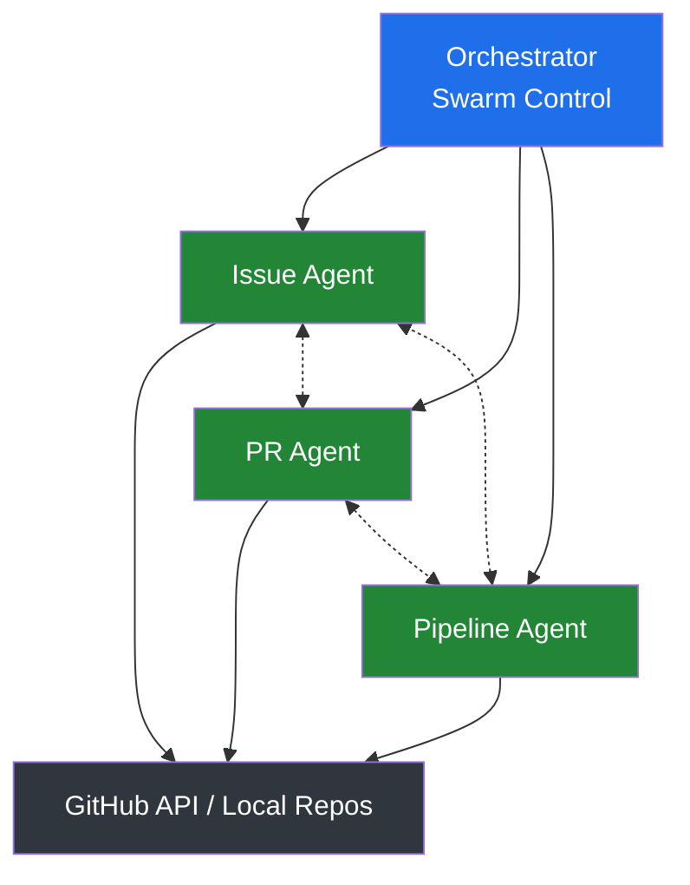
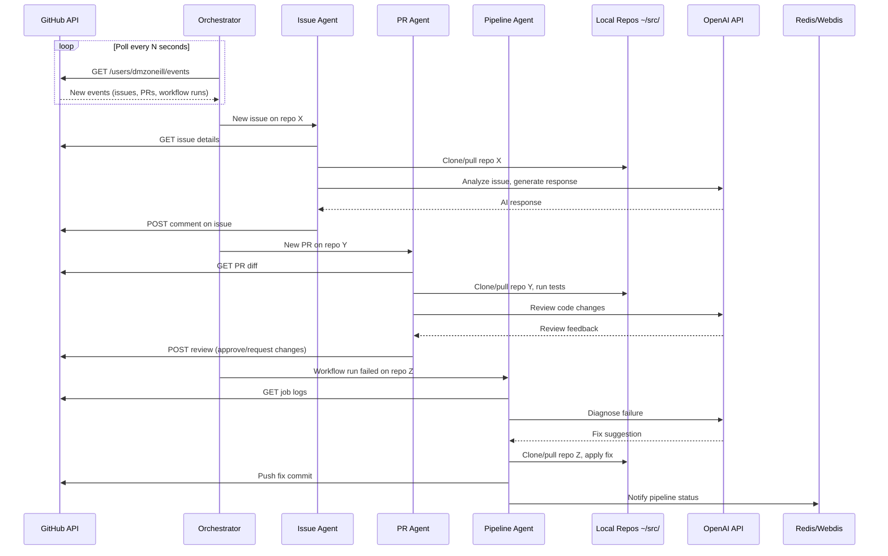
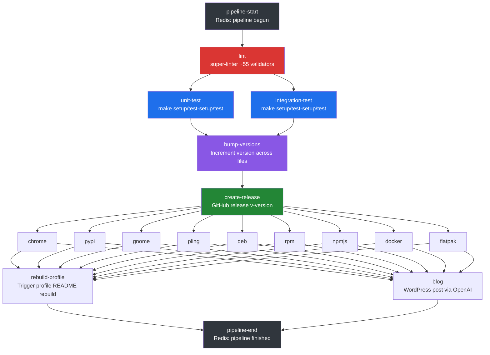
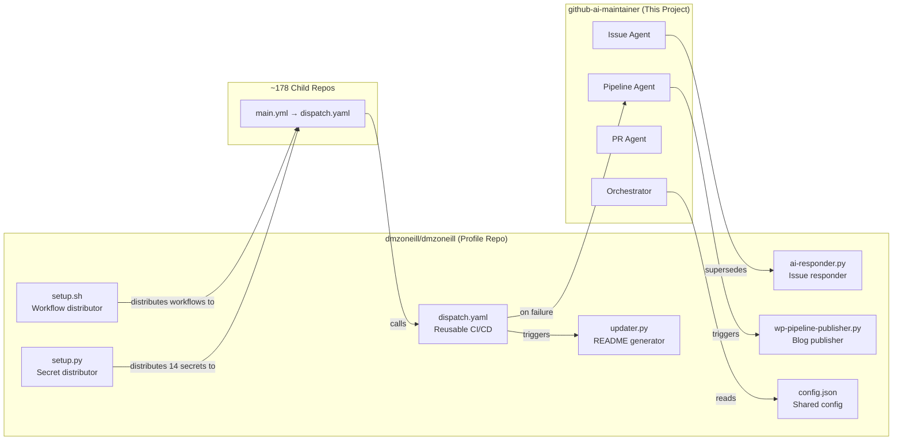
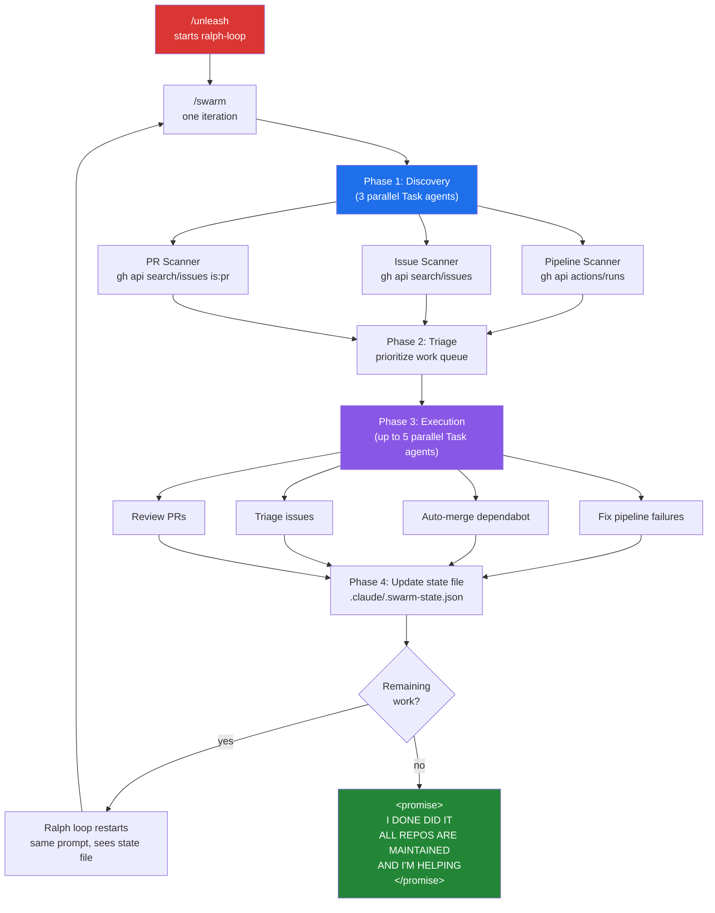

# CLAUDE.md

This file provides guidance to Claude Code (claude.ai/code) when working with code in this repository.

## What This Project Is

`github-ai-maintainer` is a multi-agent system that autonomously maintains all GitHub repositories owned by `dmzoneill` (~178 repos). It uses a swarm of specialized AI agents that monitor and act on GitHub issues, pull requests, and CI/CD pipeline failures — either focusing on a single project at a time or working independently across multiple projects in parallel.

This project replaces and extends the ad-hoc automation scripts currently living in the `dmzoneill` profile repo (ai-responder.py, wp-pipeline-publisher.py) with a coordinated agent architecture.

## GitHub Owner Context

- **GitHub user**: `dmzoneill` (Dave)
- **Repos**: ~178 public repos across Python, JavaScript, PHP, Java, C#, Shell, Go, TypeScript, and more
- **Existing infrastructure**: The `dmzoneill` profile repo already has a reusable `dispatch.yaml` workflow (~1400 lines) distributed to all repos via `setup.sh`, plus 14 secrets distributed via `setup.py`. All repos share CI/CD through this dispatch workflow.
- **Repos are cloned to**: `~/src/<repo-name>`
- **Auth**: GitHub CLI (`gh`) authenticated as `dmzoneill` via `GITHUB_TOKEN` with repo, workflow, project, read:org scopes

## Architecture

### Agent Swarm

The system uses a coordinator pattern with specialized worker agents:



### Agent Event Flow



### Orchestrator

Central coordinator that:
- Polls GitHub for events across all `dmzoneill` repos (issues opened, PRs created, pipeline failures)
- Maintains a work queue of tasks for agents
- Assigns tasks to appropriate agents based on type
- Manages agent concurrency — can run agents in parallel across different repos or serialize work on a single repo
- Tracks agent state and task completion
- Handles inter-agent communication (e.g., Pipeline Agent discovers a bug → creates an issue → Issue Agent picks it up)

### Issue Agent

Responsibilities:
- Responds to new issues with AI-generated analysis (replacing `ai-responder.py` from the profile repo)
- Triages issues: labels them, assigns priority, identifies which component is affected
- For bug reports: attempts to reproduce locally by cloning the repo to `~/src/`, running tests, reading logs
- For feature requests: analyzes feasibility, drafts implementation plan
- Can create linked PRs for straightforward fixes
- Skips dependabot/bot-generated issues

### PR Agent

Responsibilities:
- Reviews incoming PRs with AI-powered code review
- Checks for common issues: security vulnerabilities, style violations, missing tests
- Runs the repo's test suite locally if available
- Approves, requests changes, or comments with specific feedback
- Auto-merges dependabot PRs that pass CI
- Validates PR descriptions and conventional commit messages

### Pipeline Agent

Responsibilities:
- Monitors GitHub Actions workflow runs across all repos (dispatch.yaml failures)
- When a pipeline fails: fetches job logs, diagnoses the failure
- Categories of failures it handles:
  - **Lint failures**: reads super-linter output, applies fixes, pushes a commit
  - **Test failures**: analyzes test output, identifies failing tests, attempts fixes
  - **Build failures**: checks dependency issues, version conflicts, missing env vars
  - **Publish failures**: checks PyPI/Docker/npm publish steps for credential or versioning issues
- Creates fix commits or issues depending on complexity
- Sends notifications via Redis/Webdis (using existing `redis-notify.py` pattern)

### Repo Manager

Utility layer shared by all agents:
- Clones repos to `~/src/<repo-name>` if not present, pulls if already cloned
- Provides a consistent interface for local repo operations (checkout branch, read files, run commands)
- Caches repo metadata (languages, structure, test commands)
- Detects project type and available tooling (Makefile, package.json, setup.py, Cargo.toml, etc.)

## Tech Stack

- **Language**: Python 3 (consistent with existing `dmzoneill` automation scripts)
- **Dependencies**: `requests` for HTTP, GitHub API via REST + GraphQL
- **AI Provider**: OpenAI API (configurable model via `AI_MODEL` env var) — same pattern as existing `ai-responder.py`
- **GitHub CLI**: `gh` for operations that benefit from it (secret management, PR creation)
- **Notifications**: Redis/Webdis for pipeline status (existing pattern from `redis-notify.py`)

## Project Structure

```
github-ai-maintainer/
├── CLAUDE.md
├── Makefile
├── version
├── requirements.txt
├── config.json                  # Agent config, polling intervals, repo filters
├── src/
│   ├── __init__.py
│   ├── main.py                  # Entry point — starts orchestrator
│   ├── orchestrator.py          # Swarm coordinator, event loop, task queue
│   ├── agents/
│   │   ├── __init__.py
│   │   ├── base.py              # Base agent class with common GitHub/AI methods
│   │   ├── issue_agent.py
│   │   ├── pr_agent.py
│   │   └── pipeline_agent.py
│   ├── github/
│   │   ├── __init__.py
│   │   ├── client.py            # GitHub API client (REST + GraphQL)
│   │   ├── events.py            # Event polling and webhook handling
│   │   └── repo_manager.py      # Local repo clone/pull/operations
│   ├── ai/
│   │   ├── __init__.py
│   │   └── provider.py          # OpenAI provider (same pattern as existing)
│   └── notifications/
│       ├── __init__.py
│       └── redis.py             # Redis/Webdis notifications
├── tests/
│   ├── __init__.py
│   ├── test_orchestrator.py
│   ├── test_issue_agent.py
│   ├── test_pr_agent.py
│   ├── test_pipeline_agent.py
│   └── test_github_client.py
└── .github/
    └── workflows/
        └── main.yml             # CI for this repo (calls dispatch.yaml)
```

## Build & Development Commands

```bash
make lint              # Format with Black
make test              # Run pytest
make run               # Start the orchestrator
make bump              # Increment patch version
make version           # lint + bump + commit
make push              # lint + bump + commit + rebase + force push
```

Run a single test:
```bash
pytest tests/test_issue_agent.py -v
pytest tests/test_issue_agent.py::TestIssueAgent::test_triage -v
```

Run the orchestrator directly:
```bash
python -m src.main
```

Run a single agent in isolation (for debugging):
```bash
python -m src.main --agent issue --repo dmzoneill/some-repo
python -m src.main --agent pipeline --repo dmzoneill/some-repo --run-id 12345
```

## Environment Variables

Reuses the same secrets already distributed across all `dmzoneill` repos:

| Variable | Purpose |
|---|---|
| `GITHUB_TOKEN` | GitHub API access (repo, workflow, issues, PRs) |
| `AI_API_KEY` | OpenAI API key for agent reasoning |
| `AI_MODEL` | OpenAI model name (e.g., `gpt-4o`) |
| `REDIS_PASSWORD` | Webdis/Redis auth for pipeline notifications |
| `WORDPRESS_URL` | WordPress REST API base URL (for blog integration) |
| `WORDPRESS_USERNAME` | WordPress auth |
| `WORDPRESS_APPLICATION` | WordPress application password |

## Centralized CI/CD Pipeline (dispatch.yaml)

All ~178 repos share a single reusable workflow: `dmzoneill/dmzoneill/.github/workflows/dispatch.yaml`. Each child repo's `.github/workflows/main.yml` is a thin wrapper that calls it:

```yaml
# Typical child repo main.yml
name: CICD
on:
  push:
    branches: ["main"]
  pull_request:
    branches: ["main"]
permissions: write-all
jobs:
  cicd:
    secrets: inherit
    uses: dmzoneill/dmzoneill/.github/workflows/dispatch.yaml@main
    with:
      pypi-extension: "true"           # toggle publish targets per-repo
      VALIDATE_DOCKERFILE_HADOLINT: "false"  # toggle linters per-repo
```

### Pipeline Stages (sequential dependency chain)



Publish jobs are each gated by a boolean input (default `"false"`). Only runs when the child repo opts in via its `main.yml`. If `test-ready != "true"`, test failures are non-blocking (`|| true`).

### Publish Targets (toggled per-repo via workflow_call inputs)

| Input | Target | Details |
|---|---|---|
| `pypi-extension` | PyPI | `python3 -m build` + `twine upload` |
| `docker-build` | Docker Hub + GHCR | Multi-arch via buildx, tags: `feeditout/<repo>:{version,latest}` + `ghcr.io/dmzoneill/<repo>:{version,latest}` |
| `npmjs` | npm registry | Via `JS-DevTools/npm-publish@v3` |
| `chrome-extension` | Chrome Web Store | Zips `chrome-plugin/` dir, uploads via `chrome-webstore-upload-cli` |
| `gnome-extension` | GNOME Extensions | Uses `gnome-extension-publisher` PyPI package |
| `pling` | Pling.com | Uses `pling-publisher` PyPI package |
| `deb-build` | GitHub Release asset | `make deb`, uploads .deb to release |
| `rpm-build` | GitHub Release asset | `make rpm`, uploads .rpm to release |
| `flatpak-build` | Flathub | `flatpak-builder` + Flathub publish action |

### Linter Validators (all enabled by default, disabled per-repo)

The `VALIDATE_*` inputs control ~55 super-linter validators. Common ones repos disable:
`VALIDATE_DOCKERFILE_HADOLINT`, `VALIDATE_JSCPD`, `VALIDATE_NATURAL_LANGUAGE`, `VALIDATE_MARKDOWN`.

Linter configs are pulled at runtime from `dmzoneill/dmzoneill/.github/linters/`: `.eslintrc.json`, `.jscpd.json`, `.ruby-lint.yml`, `.stylelintrc.json`, `.htmlhintrc`, `config/rubocop.yml`.

### Redis Notifications

Every pipeline stage sends a notification to Webdis/Redis via the custom action `dmzoneill/dmzoneill/.github/actions/redis@main`. Format: `{sha} {repo} {stage} complete`. The Pipeline Agent can subscribe to these to track pipeline progress in real-time.

### What the Pipeline Agent Needs to Know

When diagnosing failures, the Pipeline Agent should:
1. Use `gh api repos/{owner}/{repo}/actions/runs/{run_id}/jobs` to list jobs
2. Use `gh api repos/{owner}/{repo}/actions/jobs/{job_id}/logs` to fetch logs
3. Map the failed job name to the pipeline stage above to understand context
4. For lint failures: the log contains super-linter output with file paths and line numbers
5. For test failures: the log contains `make test` output (pytest for Python repos)
6. For publish failures: check credentials, version conflicts, and package-specific errors
7. For version bump failures: check if the `version` file exists and is properly formatted

### Test Convention Across Repos

Repos that support testing follow a Makefile convention:
- `make setup` — install project dependencies
- `make test-setup` — set up test fixtures/environment
- `make test` — run the test suite
- Python repos use `pipenv` for dependency management

## Profile Repo Scripts (dmzoneill/dmzoneill)

The `dmzoneill` profile repo contains the scripts that this project builds upon. Understanding them is critical because agents will interact with or replace their functionality.

### updater.py — Profile README Generator

`ReadmeUpdater` class (1047 lines). Runs every 6 hours via `main.yml` workflow.

- Reads `config.json` (GitHub API URLs, shields.io badge mappings for 30+ languages, live project links, organization list) and `template.md` (HTML template with custom XML-like tags)
- Fetches data from GitHub API using **GraphQL** (paginated, 100 repos/page) with REST fallback:
  - All repos, their languages (byte counts), issues, PRs, gists, events, first commit dates
- Two-tier caching in `generated/`:
  - `cache.json`: 12-hour TTL for API responses
  - `permanent_cache.json`: immutable data (first commit dates) — never expires
- Generates an SVG timeline (`generated/timeline.svg`) showing project creation years with proportional bubble sizes
- Substitutes template tags (`<repos>`, `<issues>`, `<prs>`, `<recent>`, `<gists>`, `<orgs>`, `<langs>`) via regex to produce final `README.md` (3100+ lines)
- Retry logic with 0.5s delays between API requests

### setup.sh — Workflow Distributor

Bash script (321 lines). Runs daily via `setup.yaml` workflow.

- Iterates all owned repos via GitHub API with pagination and Link header detection
- For each repo: checks if `.github/workflows/main.yml` and `ai-responder.yml` exist via raw.githubusercontent.com
- Compares MD5 checksums — only pushes when files are missing or changed
- Clones repos into temp directories, copies workflow files, commits, and pushes
- Sets `profile_hook` secret on repos where token has admin permissions
- Handles both authenticated (`/user/repos`) and unauthenticated (`/users/dmzoneill/repos`) API paths

### setup.py — Secret Distributor

Python script. Distributes 14 secrets to all owned repos via `gh secret set`:

`PROFILE_HOOK`, `AI_API_KEY`, `AI_MODEL`, `DOCKER_TOKEN`, `PYPI_TOKEN`, `WORDPRESS_APPLICATION`, `WORDPRESS_PASSWORD`, `WORDPRESS_URL`, `WORDPRESS_USERNAME`, `YOUTUBE_API`, `UNSPLASH_ACCESS_KEY`, `CI_USERNAME`, `CI_PASSWORD`, `REDIS_PASSWORD`

- Fetches existing secrets per-repo first, skips repos that already have them
- Authenticates `gh` CLI by writing token to temp file, then removes it

### ai-responder.py — Issue Auto-Responder

Python script (73 lines). Triggered by `ai-responder.yml` on issue open events across all repos.

- `get_issue_content()`: fetches issue title + body from GitHub API
- `generate_ai_reply()`: sends to OpenAI GPT-4o with system prompt "You're a helpful AI assistant. Reply concisely to the following GitHub issue." Temperature: 0.5, timeout: 30s
- `post_comment()`: posts AI response as issue comment
- Env vars: `OPENAI_API_KEY`, `GITHUB_TOKEN`, `GITHUB_REPOSITORY`, `ISSUE_NUMBER`, `ISSUE_REPO_URL`
- Does NOT respond to dependabot issues (filtered in workflow)

### wp-pipeline-publisher.py — Blog Post Generator

Python script (808 lines). Triggered post-release in the dispatch workflow's `blog` job.

- Fetches latest commit diff from GitHub API
- Determines if change is "substantial": feat/fix/perf commits, 25+ changed lines in non-doc files, or `Blog = true` in commit message
- Generates HTML blog post via OpenAI with system prompt emphasizing bug fixes, refactoring, feature enhancements
- Enriches content with Unsplash images (via API search) and YouTube videos (via API search)
- Publishes to WordPress REST API using Basic Auth (`WORDPRESS_USERNAME:WORDPRESS_APPLICATION`)
- Extracts release URLs from GitHub Actions job logs (PyPI, Docker Hub, GHCR patterns)

### redis-notify.py — Pipeline Notification

Python script (42 lines). Sends pipeline status messages to Webdis/Redis.

- Takes message as CLI argument, strips `dmzoneill/` prefix
- Sends `RPUSH/fio/{message}` to Webdis endpoint (default: `185.219.84.242:6380`)
- Uses Basic Auth with `REDIS_PASSWORD` env var

### config.json — Shared Configuration

Contains API URLs, badge mappings, and metadata:
- `api_url`: GitHub GraphQL endpoint
- `repos_url`, `events_url`, `gists_url`: GitHub REST endpoints
- `badges`: mapping of ~30 programming language names to shields.io badge image URLs
- `live`: mapping of repo names to deployment URLs (PyPI, Chrome Web Store, GNOME Extensions, app stores, etc.)
- `organizations`: list of GitHub orgs whose forks to include (RedHat Insights, AppSRE, Canonical, Intel)

## Integration With Existing Infrastructure



- **dispatch.yaml**: All repos use the centralized dispatch workflow described above. The Pipeline Agent reads failure logs from these workflow runs.
- **setup.sh / setup.py** (in profile repo): Distributes `main.yml` + `ai-responder.yml` workflows and 14 secrets to all owned repos. This project consumes those same secrets.
- **ai-responder.py**: The Issue Agent supersedes this script with richer triage and fix capabilities.
- **wp-pipeline-publisher.py**: Blog publishing can be triggered by agents when they land significant fixes.
- **config.json** (profile repo): Contains badge mappings, live project links, and org info that agents can reference.

## Slash Commands and Skills

### Commands (`.claude/commands/`)

Quick-invoke operations via `/command-name`:

| Command | Description |
|---|---|
| `/scan-issues [repo\|all]` | Scan repos for open issues, categorize, and suggest actions |
| `/scan-pipelines [repo\|all]` | Find failed CI/CD runs, map to dispatch.yaml stages, extract errors |
| `/scan-prs [repo\|all]` | Find open PRs, categorize, suggest auto-merge for dependabot |
| `/repo-sync [repo\|all]` | Clone or pull repos to `~/src/`, report status |
| `/repo-status [repo\|all]` | Health dashboard: CI status, open issues/PRs, last commit, staleness |
| `/maintain [repo\|all]` | Full maintenance cycle: fix pipelines, triage issues, review PRs, report |
| `/distribute-workflows` | Check and push CI/CD workflows + secrets to all repos (like setup.sh) |
| `/swarm` | Launch full parallel agent swarm — 3 discovery agents + N worker agents |
| `/unleash` | Start a ralph-loop running `/swarm` continuously until all repos are clean |

### Skills (`.claude/skills/`)

Richer agent capabilities that Claude can also auto-invoke:

| Skill | Description |
|---|---|
| `/issue-triage [repo] [#]` | Full issue lifecycle: fetch, categorize, analyze code, post response, label |
| `/pr-review [repo] [#]` | Code review: fetch diff, check security/style/tests, run tests locally, post review |
| `/pipeline-fix [repo] [run-id]` | Diagnose failed pipeline stage, fetch logs, apply fix, push commit |
| `/repo-sync [repo\|all]` | Sync repos to ~/src/, detect project type, report health |

### How They Work Together

The `/maintain` command is the orchestrator — it calls the scanning commands to find work, then dispatches to the appropriate skill:

```mermaid
graph LR
    M[/maintain] --> SP[/scan-pipelines]
    M --> SI[/scan-issues]
    M --> SPR[/scan-prs]
    SP -->|failures found| PF[/pipeline-fix skill]
    SI -->|issues found| IT[/issue-triage skill]
    SPR -->|PRs found| PR[/pr-review skill]
    PF -->|complex failure| SI2[creates issue]
    style M fill:#1f6feb,color:#fff
```

### The Swarm (ralph-loop continuous operation)

`/unleash` starts a ralph-loop that runs `/swarm` repeatedly until zero work remains. Each iteration is a full cycle:



**State persistence**: `.claude/.swarm-state.json` tracks what was processed so ralph-loop iterations don't redo work. Each iteration picks up remaining items.

**Safety rails**: Max 10 fix commits per iteration. Max 20 ralph-loop iterations. Rate limit check at start of each iteration (stops if < 500 remaining). Never auto-merges non-bot PRs. Never modifies dispatch.yaml.

**Monitoring**: `cat .claude/.swarm-state.json | python3 -m json.tool`

**Emergency stop**: `/cancel-ralph`

## Key Design Decisions

- **Polling over webhooks**: Uses GitHub API polling (events endpoint) rather than requiring a webhook server, keeping deployment simple (single process, no exposed ports).
- **Local repo operations**: Agents clone and work on repos locally in `~/src/` rather than using GitHub's API for all file operations — this enables running tests, linters, and builds.
- **Graceful degradation**: Each agent operates independently. If one agent fails or hangs, others continue. The orchestrator restarts failed agents.
- **Rate limiting**: GitHub API has 5000 req/hour for authenticated users. The orchestrator tracks rate limit headers and throttles agents when approaching limits.
- **Idempotency**: Agents track what they've already processed (by event ID / issue number / run ID) to avoid duplicate responses on restart.

## Conventions

- Follow the existing pattern from the `dmzoneill` profile repo: environment-variable config, `requests` for HTTP, class-based providers, print-based logging.
- Use the same Makefile pattern (`lint`, `bump`, `version`, `push` targets) as the profile repo.
- Version file format: `version=X.Y.Z` in `./version`.
- Single-branch git model on `main` with force push.
